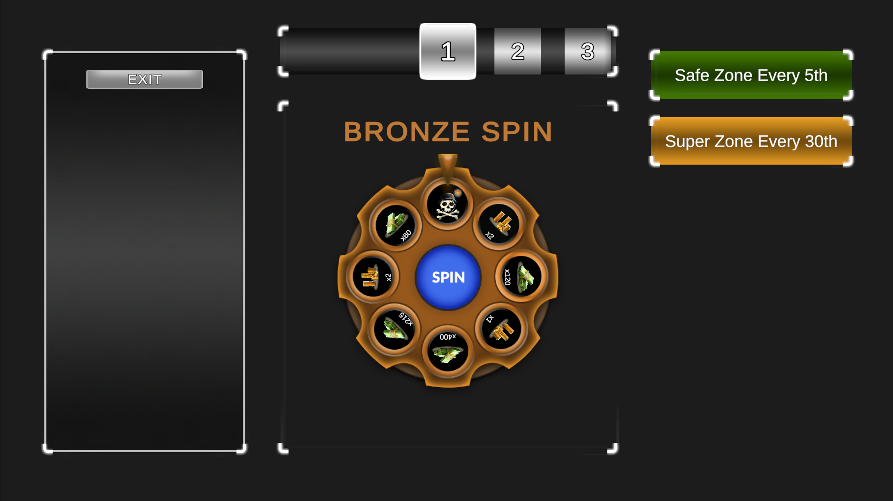
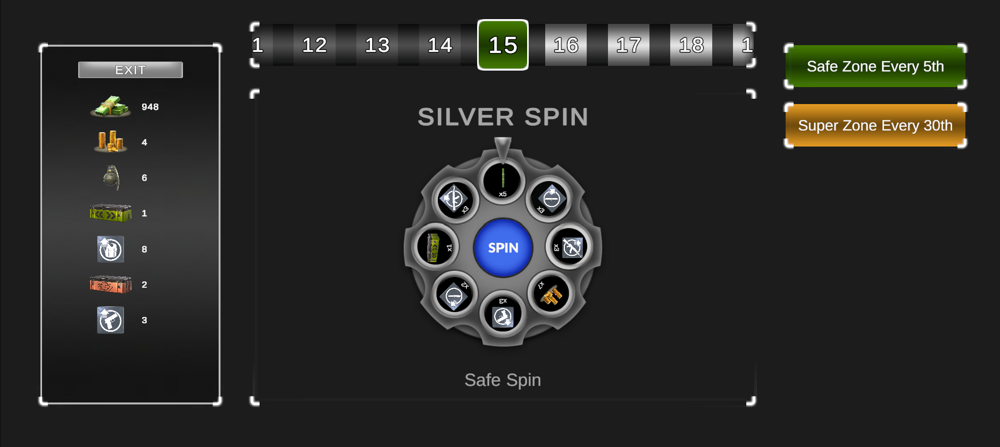
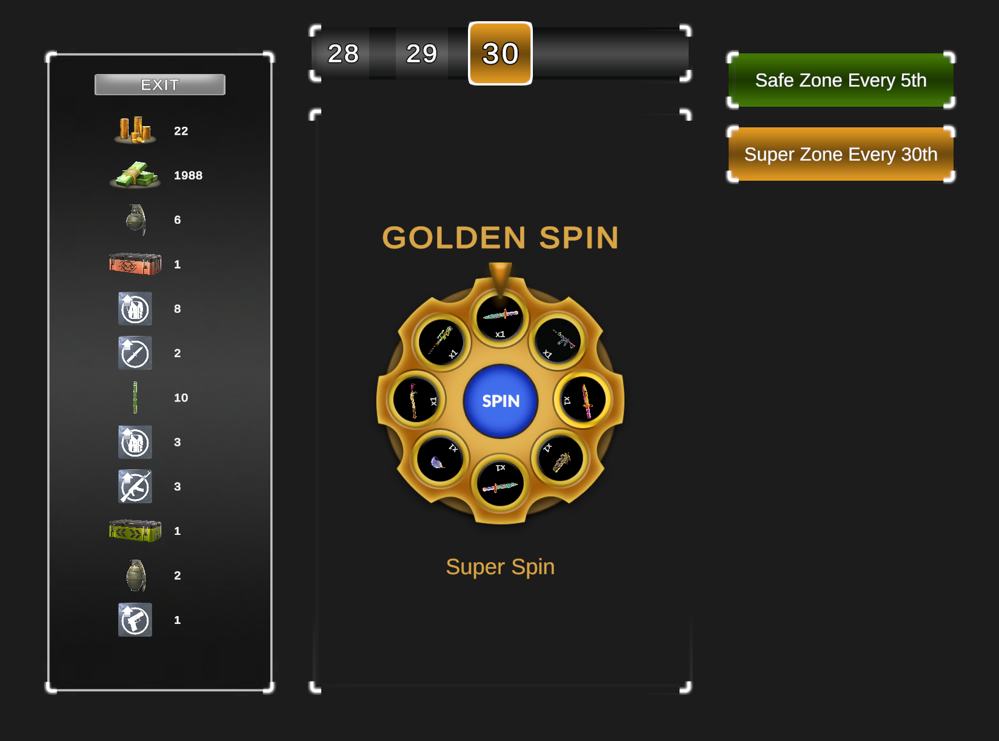
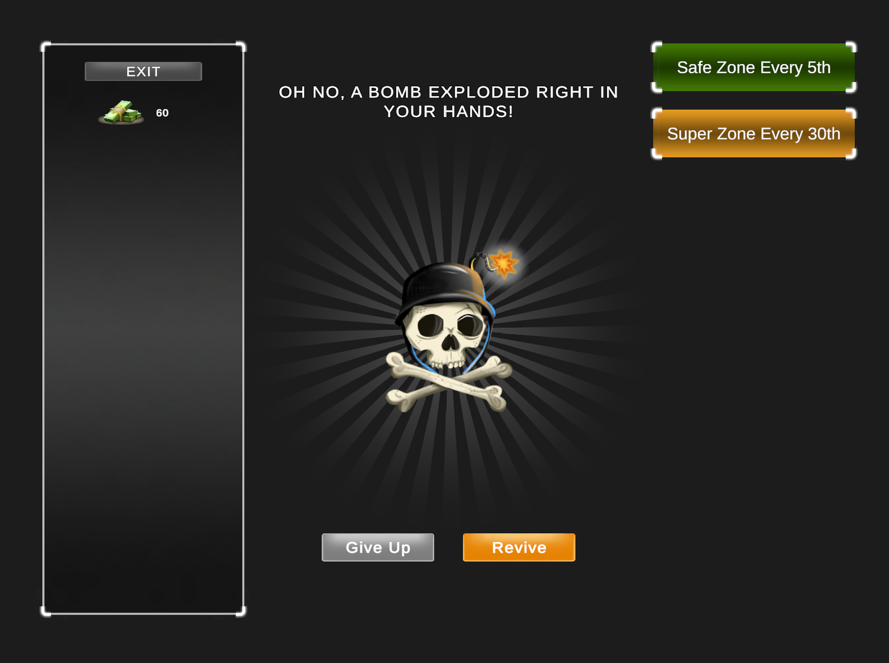
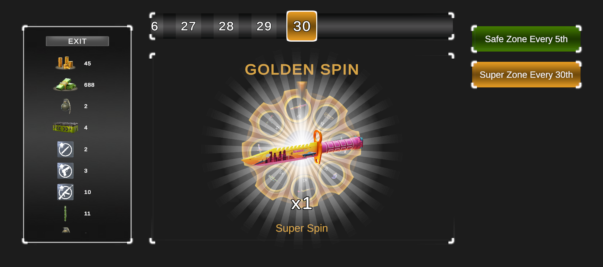
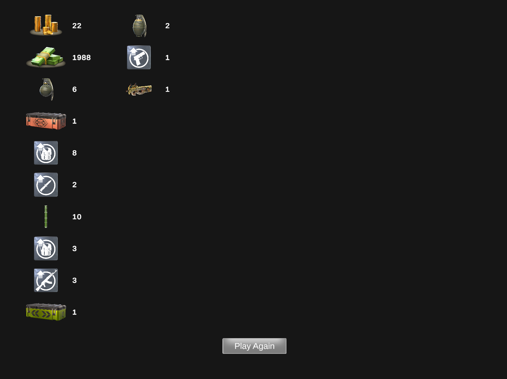

# Wheel Spin Game
### Vertigo Games Game Developer Demo by Perihan Yıldız Topal

A mobile wheel-spin game developed for a Unity game development case study, where the player wins rewards and goes through zones by spinning a wheel until they trigger a bomb.

### Video
A short gameplay video can be found here:  https://youtu.be/J_5XxlID7p4.

### Screenshots

### Release
The latest Android build is available in the GitHub Releases section.

### Requirements
- Unity 2021.3.45f2
- Android